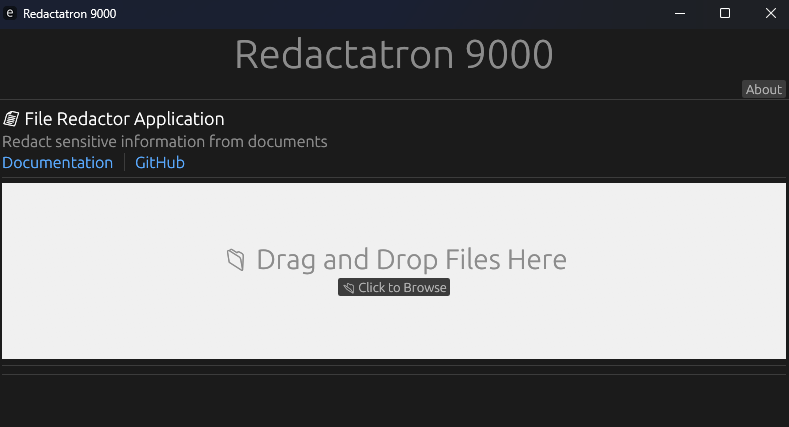

# Redactatron

A Rust-based document redaction desktop application that helps you safely remove sensitive information from PDFs, Word documents, and images. Redactatron provides an intuitive graphical user interface for redacting documents with precision. I built this to explore Rust UI development and learn how redaction works—and how to design software that performs it reliably.




## How Redactions Work

Redactatron uses a visual marking and rasterization approach to ensure complete removal of sensitive content:

1. **Load & Display**: Open a PDF, Word document (.docx), or image. Word documents are automatically converted to PDF for processing using Pandoc
2. **Mark Redactions**: Visually draw rectangles over sensitive content in the editor. You can mark multiple areas across multiple pages
3. **Search & Navigate**: Use the search feature to find specific terms or phrases, then quickly navigate to and redact them
4. **Review & Edit**: Delete individual redactions by right-clicking, or clear all redactions for a file
5. **Rasterize & Export**: Convert redacted PDFs to rasterized images (high-quality PNG embedded in PDF) at your chosen DPI, ensuring content is permanently removed at the pixel level

The rasterization approach guarantees that redacted content cannot be recovered, as the sensitive areas are replaced with solid pixels rather than simply hidden.

## Features

- **Multi-format Support**: Redact PDFs, Word Documents, and Images
- **Visual Editor**: Interactive GUI to preview and mark areas for redaction
- **Export Options**: Export redacted documents as PDFs or rasterized PNG images
- **Accurate Redaction**: Completely removes sensitive content, not just obscuring it. 

## Project Structure

This is a workspace project with two main components:

- **redactor-core**: Core redaction engine with document processors and exporters
  - PDF processing
  - Words Document processing
  - Rasterized export capabilities
  
- **redactor-ui**: Desktop GUI application built with egui
  - Home page for document selection
  - Visual editor for marking redaction regions
  - Real-time preview with PDF and image rendering

## Prerequisites

- **Pandoc**: [Download and install](https://pandoc.org/installing.html) for Word Document conversion
- **MiKTeX**: [Download and install](https://miktex.org/download) for PDF engine (pdflatex) - required by Pandoc for converting documents to PDF
- **pdfium**: [Download pdfium binaries](https://github.com/bblanchon/pdfium-binaries/releases) and add to your system PATH

**For building from source:**
- **Rust**: Built with Version 1.90.0 [Install Rust](https://rust-lang.org/)
- **Cargo**: Comes with Rust
- **Development Tools**: Review Rust documentation for this.

## Setup Instructions

### Option 1: Using Pre-built Release (Recommended)

1. Download the latest release from [GitHub Releases](https://github.com/wcagreen/redactatron/releases)
2. Extract the executable
3. Ensure the following are installed and in your system PATH:
   - Pandoc
   - MiKTeX (for pdflatex PDF engine)
   - pdfium binaries
4. Run `Redactatron.exe` (Windows) or `./Redactatron` (macOS/Linux)

### Option 2: Build from Source

#### 1. Clone the Repository

```bash
git clone https://github.com/wcagreen/redactatron.git
cd redactatron
```

#### 2. Build the Project

Build the application:

```bash

# Build just the UI application
cargo build --release -p redactor-ui
```

#### 3. Run the Application

Launch the GUI application:

```bash
cargo run --release -p redactor-ui
```

The Redactatron desktop application will open, allowing you to:
1. Load a document from the Home page
2. Use the visual editor to mark areas to redact
3. Export your redacted document

## Usage

After launching the application, you can perform the following actions:

1. **Load Document**: Click to open a PDF or document file, or drag and drop your files into the drop zone
2. **Mark Redactions**: Use the editor to select and mark areas to redact
3. **Delete Redaction**: You can delete all redactions for a selected file, or hover over individual redactions and right-click to delete them
4. **Search Terms**: Search for terms and phrases; results appear on the right side of the screen, allowing you to navigate to them quickly
5. **Export**: Save your redacted file as either an Image or PDF, depending on the original file type


## License

This project is licensed under the MIT License - see the [LICENSE](LICENSE) file for details.

## Credits

- **Pandoc**: Used for converting Word Documents to PDFs to enable proper rendering and redaction of document content. Users must install Pandoc separately.
- **pdfium**: PDF processing engine used by pdfium-render for rendering and manipulating PDF documents. Users must install pdfium binaries separately.

## Author

Created by [William Green](https://github.com/wcagreen)

## Contributing

Contributions are welcome! Please feel free to submit a Pull Request.

## Troubleshooting

### Pandoc not found
Make sure Pandoc is installed on your system:
- **Windows/macOS/Linux**: Download from [pandoc.org/installing.html](https://pandoc.org/installing.html)

If installed but not found, ensure it's in your system PATH or the application can locate it.

### Word Document fails to open or convert
Word documents (.docx) are converted to PDF internally using Pandoc. If conversion fails:
- Verify Pandoc is properly installed and accessible from the command line
- Verify MiKTeX is installed (provides pdflatex engine required by Pandoc for PDF conversion): [Download MiKTeX](https://miktex.org/download)
- Try converting the document with Pandoc directly to ensure it's valid: `pandoc input.docx -o output.pdf`
- Check that the document doesn't have unusual formatting or corruption

### PDF fails to open or render
PDF rendering depends on pdfium binaries. If PDFs fail to open:
- Verify pdfium binaries are installed and in your system PATH
- Ensure the PDF file is not corrupted by opening it in another PDF viewer
- Try with a different PDF to isolate the issue

### pdfium not found
Ensure pdfium binaries are installed:
- Download from [pdfium-binaries](https://github.com/bblanchon/pdfium-binaries/releases)
- Extract the binaries and add them to your system PATH

### Checking Application Logs

If you encounter issues, detailed logs are available to help diagnose problems:

**Log File Location:**
- **Windows**: `C:\Users\{YourUsername}\AppData\Local\redactatron\data\logs\redactor.log`
- **macOS**: `~/Library/Application Support/redactatron/logs/redactor.log`
- **Linux**: `~/.local/share/redactatron/logs/redactor.log`

Or fallback location: `redactor.log` in your current working directory

**To View Logs:**
1. Navigate to the log file location above
2. Open `redactor.log` with any text editor
3. Look for error messages with timestamps to identify when issues occurred
4. Share relevant log excerpts when reporting issues

The logs contain detailed information about file loading, processing, conversions, and any errors encountered during document redaction.


